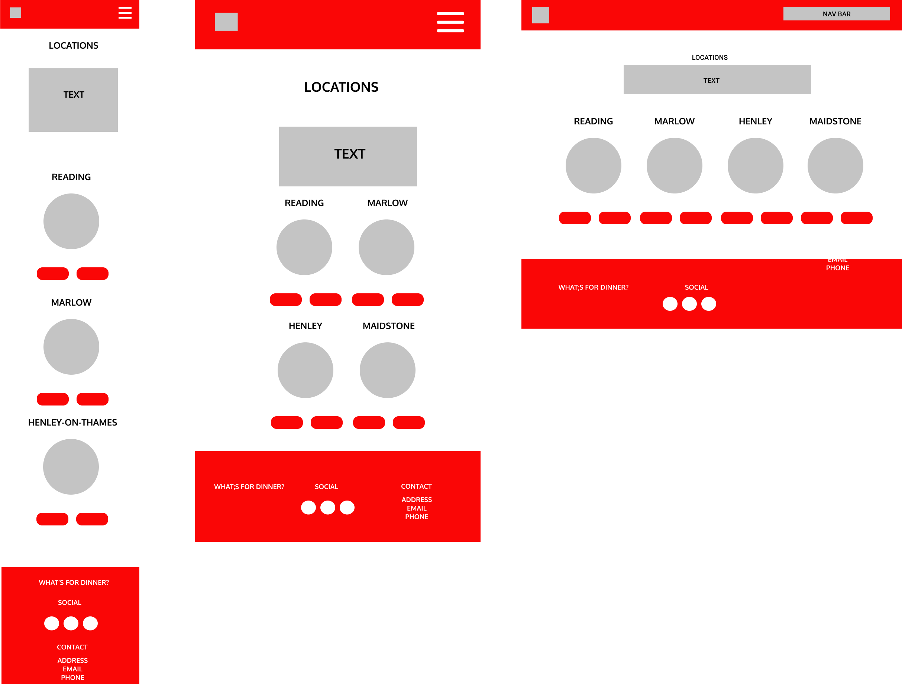
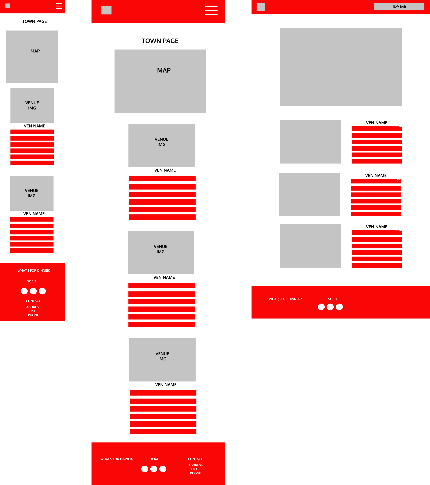
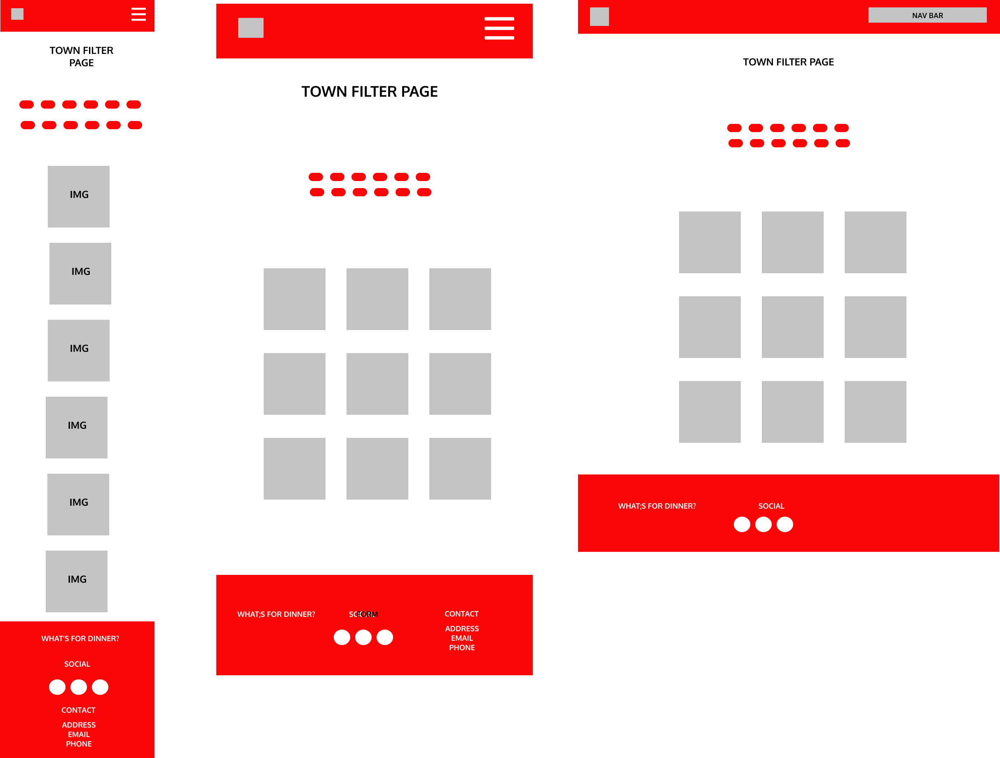

# **CODE INSTITUTE: MILESTONE PROJECT 2** #

# **WHAT'S FOR DINNER?** #

This website was designed to offer the user a "one-stop" site to be able to search for restaurants in their desired town. The site allows them to filter the restaurants by cost/style and to then be provided the contact details of the chosen restaurant or to be able to hop on to their booking engine. The site also provides an unfiltered list and locations are provided using the Google Maps API so that they can see where the restaurants are located. There is also the option to sign up for updates and for businesses to request to join the site.

This is the second of four Milestone Projects required for the Full Stack Web Development course provided by Code Institute. The main goal for this project was to produce an "interactive front-end site to present useful information to the users" using HTML, CSS and JavaScript.

## **CONTENTS** ##

- [UX](#ux)
  - [Project Goals](#project-goals)
  - [User Stories](#user-stories)
  - [Design Process](#design-process)
    - [Fonts](#fonts)
    - [Colours](#colours)
    - [Wireframes](#wireframes)
- [Technology Used](#technology-used)
  - [Languages and Frameworks](#languages-and-frameworks)
  - [Tools](#tools)
- [Features](#features)
- [Testing](#testing)
    - [User Stories](#user-stories)
    - [Responsiveness](#responsiveness)
    - [Browser Compatability](#browser-compatability)
    - [Code Validation](#code validation)
    - [Accesibility Validation](#accessibility-validation)
    - [Issues Experience](#issues-experienced)
- [Deployment](#deployment)
  - [Hosting](#hosting)
  - [Cloning](#cloning)
- [Credits](#credits)
  - [Images](#images)
  - [Image editing](#image-editing)
- [Acknowledgements](#acknowledgements)

## **UX** ##

### <ins>PROJECT GOALS</ins> ### 

The main aim of this project was to create a website that would give the user a useful website that would allow them to see local restaurants and to be able to filter the available restaurants by cost/style. Information would be provided to the user and also the ability to link to the individual restaurant sites to allow them to book through their booking engine or to contact them directly.
 
- To promote restaurants in the area to the **user** to help increase footfall and therefore revenue.
- To provide an intuitive web app that the **user** can navigate easily.
- To gain contact details from the **user** to allow future updates/additions to the site to be communicated by the **site owner**.

[Back to Contents](#contents)

### <ins>USER STORIES</ins> ###

- As a **user**, I want to see what restaurants are available in the town that I am in.
- As a **user**, I want to be able to choose a restaurant based on it's price level.
- As a **user**, I want to be able to choose a restaurant based on the type of food it offers.
- As a **user**, I want to be able to see where the restaurants are located within the town I am interested in.
- As a **user**, I want to be able to contact the restaurant of choice either through their website booking engine or by being provided contact details.
- As a **user**, I want to be able to obtain basic information about the restaurants in the town that I am to help me decide where to reserve a table.
- As a **user**, I want the site navigation to be intuitive and easy to use.
- As a **user**, I want the information to be displayed in a clear and organised manner to allow for quick decisions to be made.
- As a **user**, I want to be able to register with the **site owners** so that I can be informed of new restaurants registering on the site.
- As a **business owner**, I want the information on the site to represent my business and to look attractive.
- As a **business owner**, I want to be able to register my interest with the **site owners** so that they can add me to the site.

[Back to Contents](#contents)

### <ins>DESIGN PROCESS</ins> ###

1. The concept of this site comes from my Hospitality background and my feeling that, due to the current pandemic, restaurants need to be championed to help them in the coming months. As this site is intended to raise user awareness of what restaurants are available in their area, I decided to keep it fairly simple and to ensure that the end result was a restaurant being booked by the user.

2. The main colour scheme chosen is red (#fa0606)and white as I felt that it was distinctive (think Vodafone or Virgin Media) and by keeping it simple it doesn't detract from the main point of the site - getting the user to book a restaurant.

3. I used [Figma](https://figma.com/) to create my wireframes and used it to organise the flow of the site and how the different pages would respond to different screen sizes. 

4. As with my first project, the design changed slightly as I was building the site. I am finding that what I initially think is a "good idea" at the start of the design process ends up not being the case and is modified during the build process. I realise that this is not the best way to build a site but am working towards ensuring the design is completed first and acts as a map for the building process.

5. I referred to my User Stories and Wireframes throughout the process and all changes made , as mentioned above, were to improve the initial design choices that were considered inappropriate.

[Back to Contents](#contents)

### <ins>FONTS</ins> ###

I chose the Oxygen font family for my headers and the Roboto font family for any body text. Both fonts were chosen from [Google Fonts](https://fonts.google.com/) and the styles were imported in to the style.css file.

### <ins>COLOURS</ins> ###

A red (#fa0606) colour for the Navigation Bar, Footer, all Buttons and the Accordion to maintain a consistent feel throughout. An other colours used were picked from the base colour to ensure a flow was visible throughout the site. The decision to use this simple colour scheme was taken from my observation that businesses such as Virgin Media and Vodafone are easily recognisable due to similar colour choices in their brand identities.

### <ins>WIREFRAMES</ins> ###

The full wireframe for the site can be found [here](assets/images/readme/figfull.png).

### Landing Page ###

### Locations Page ###

### Town Pages ###

### Filter Pages ###

### Register Page ###

[Back to Contents](#contents)

---  

## **TECHNOLOGY USED** ##

### <ins>LANGUAGES AND FRAMEWORKS</ins> ###

- [HTML](https://developer.mozilla.org/en-US/docs/Web/HTML) - used to create the site structure.
- [CSS](https://developer.mozilla.org/en-US/docs/Web/CSS) - used to create the styling throughout the site.
- [JavaScript](https://developer.mozilla.org/en-US/docs/Web/JavaScript) - this was used for the modal information, the Google Maps markers, the "back to top" button and the registration forms - user and business user.  
- [jQuery](https://jquery.com/) - this was used for the image filtering function.
- [Font-Awesome](https://fontawesome.com/icons?d=gallery) - icons were taken from this site for the footer and social buttons.
- [Bootstrap](https://getbootstrap.com/) - I relied on Bootstrap for the responsive grid design, carousel and card components.
- [Google fonts](https://fonts.google.com/) - as previously stated, the fonts used were taken from here.
- [Popper](https://popper.js.org/)
- [Popper JS](https://popper.js.org/)
- [EmailJS](https://emailjs.com) - this was used to host the email functionality of the site.
- [Google Maps API](https://developers.google.com/maps/) - this was used to allow Google Maps and Markers to be installed on the site.
  
### <ins>TOOLS</ins> ###

- [Git](https://git-scm.com/) - version control and recording of all changes to site during development process.
- [GitHub](https://github.com/) - used for hosting website.
- [GitPod](https://gitpod.io) - IDE used for code editing. 
- [Figma](https://figma.com/) - wireframing
- [Google Fonts](https://fonts.google.com/) - used to select font families.
- [W3C Validator](https://validator.w3.org/) - used to test my HTML to ensure there were no errors.
- [W3C Validator CSS](https://jigsaw.w3.org/css-validator/) - used to test my CSS to ensure there were no errors.
- [JSHint](https://https://jshint.com/) - used to test my JS to ensure there were no errors.
- [WAVE](https://wave.webaim.org/) - used to test accesibility of site.
- [Free Formatter](https://freeformatter.com/html-formatter.html#ad-output) - html formatter to help keep things tidy!
- [Am I Responsive](http://ami.responsivedesign.is/#) - used to create responsive image for readme.MD.
- [Favicon](https://favicon.io/) - used to generate the Favicon on the webpage tab.
- [Snazzy Maps](https://snazzymaps.com) - used to change the Google Map style.

[Back to Contents](#contents)

---

## **FEATURES** ##

### <ins>FEATURES IMPLEMENTED</ins> ###
 
 - NavBar with dropdowns to allow easy navigation of the web app. Able to reach all pages from the NavBar without having to return to the Landing Page. 
 - Links to external websites so that the user can get more information on the venue that they are interested.
 - Multiple links to each venues booking engine so that the ultimate goal can be achieved - the **user** makes a booking.
 - Footer contants Social Media links to the site owners pages.
 - Google Maps API implemented on each town page with markers for each venue. Desktop first clik gives venue name and second click gives venue name and a snippet of info. All other devices only receive the venue name and snippet on touching the marker.
 - EmailJS API used for sign up of **user** to receive more information in the future and for any new **business owners** to request addition to the site. EmailJS sends an email to the **user** or **business owner** saying "Thank You".
 - Modals used on image click in the filter page to provide the **user** with more information about the filtered venue.
 - Bootstrap used for site structure. 
 - Bootsrap Accordion used for containing the venue information in an appealing and tidy manner.
 - Back to top button used as site pages can get quite lengthy.
 - Favicon used in title of web page.
 - Hover used on all buttons and web/email address links.
 
### <ins>FUTURE FEATURES</ins> ###

- **Users** to be able to leave reviews of the restaurants to other **users**.
- Highlight new restaurants as they are added with a banner on their information image.
- **Business Owners** able to completely register their restaurant without waiting for the **site owner** to contact them.
- Multiple images available for each restaurant possibly in a Carousel or Image Gallery format.

[Back to Contents](#contents)

---

## **TESTING** ##

### <ins>USER STORIES</ins>

I asked 5 people to test the site as **users** as I neared the end of the development process to ensure that that the User Stories needs had been met. The following feedback was given from the group:

- As a **user**, I want to see what restaurants are available in the town that I am in.
    - The **users** pressed the "Let's Eat' button on the Landing Page and is taken to locations.html. They are then able to select their town of choice by either pressing the town image or the Full List button. This takes them to the required "town_name".html page which contains the map and full venue listing. It was poined out that once in the "town_name".html page you had to navigate back to the landing page to be able to choose a different town. The Locations NavBar option was added at this point to make site navigation easier. This requirement was deemed as completed.
- As a **user**, I want to be able to choose a restaurant based on it's price level.
    - The **users** pressed the appropriate "Filters" button on location.html and is taken to the "town_name"filter.html page. They are then able to filter the restaurants by pressing one of the displayed buttons (£, ££, £££, ££££) used to indicate an increasing price point. It was pointed out that on mobile it was unclear by some users as to what to do next. Text was added below the town name to prompt the **user** to click on image to gain more information. This requirement was deemed as completed.
- As a **user**, I want to be able to choose a restaurant based on the type of food it offers.
    - The **users** pressed the appropriate "Filters" button on location.html and is taken to the "town_name"filter.html page. They are then able to filter the restaurants by pressing one of the displayed buttons indicating food style . As above, it was pointed out that on mobile it was unclear by some users as to what to do next. Text was added below the town name to prompt the **user** to click on image to gain more information. This requirement was deemed as completed.
- As a **user**, I want to be able to see where the restaurants are located within the town I am interested in.
    - The **users** pressed the image or "Full List" button of the required town on locations.html and is taken to the "town_name".html page. A Google Map is located at the top of the screen and has Marker pins that drop on to the map with the locations of all the restaurants listed. It was pointed out that, on mobile, when you press the marker it only brought up the description text and that it wasn't clear what each Marker related to. The Restaurant name was added to the description so that this was solved. This requirement is deemed as completed. 
- As a **user**, I want to be able to contact the restaurant of choice either through their website booking engine or by being provided contact details.
    - The **users** either acceses the details through pressing the image on the "town_name"filter.html and receiving a modal with the information or by using the accordion on "town_name".html. The website links are connected to the required restaurants website, the phone number is available and the "Book" button takes the **user** to the Restaurant's booking engine (where applicable). This requirement is deemed as completed.
- As a **user**, I want to be able to obtain basic information about the restaurants in the town that I am to help me decide where to reserve a table.
    - The **users** either acceses the details through pressing the image on the "town_name"filter.html and receiving a modal with the information or by using the accordion on "town_name".html. The website links are connected to the required restaurants website, the phone number is available and the "Book" button takes the **user** to the Restaurant's booking engine (where applicable). This requirement is deemed as completed.
- As a **user**, I want the site navigation to be intuitive and easy to use.
    - The **users** are presented with a landing page with a very clearly positioned button to press to take them to locations.html along with a NavBar that has links to all the pages on the site. The NavBar, initially, only linked the "town_name".html pages which meant the **user** had to navigate back to the Landing Page to effectively move around the site. Dropdowns were added to include the Full List and Filtered options and also a link to the Locations Page and Register Page. Total site access was achieved by doing this. This requirement is deemed as completed.
- As a **user**, I want the information to be displayed in a clear and organised manner to allow for quick decisions to be made.
    - The **users** felt the simple colour choice of red (#fa0606) and white was distinctive. It was mentioned that, especially in the info panel on the Accordion, the colour choice was slightly abrasive on the eyes to look at so much red text on a white background. The Accordion content was changed to color: black to make this easier to read. Once this was done the **users** felt this was an improvement. This requirement is deemed to be completed. 
- As a **user**, I want to be able to register with the **site owners** so that I can be informed of new restaurants registering on the site.
    - The **users** pressed the "Register" dropdown option on the NavBar and selected "New User". A simple form is presented where they are prompted to input their Name and Email address. On clicking the "Register" button it was pointed out that the form did not clear. An email was sent to them confirming they had registered and this was seen as a good thing. Form clearing still needs to be done.

As this site is a test project, I was unable to get the **business owner** user stories tested, however, I feel that they have been completed.

- As a **business owner**, I want the information on the site to represent my business and to look attractive.
    - Restaurants are highlighted by Markers on the Google Map, Restaurant Image, Accordion with Info and Modal. 
- As a **business owner**, I want to be able to register my interest with the **site owners** so that they can add me to the site.
    - **Business Owners** are able to register their business by clicking the "Register" button and selecting "New Business". On pressing "Register", again the form doesn't clear, and an email is sent to them saying "one of the team will be in touch".

[Back to Contents](#contents)

### <ins>RESPONSIVENESS</ins>

The sites responsiveness was tested by the following methods:

- Chrome Developer Tools were used to test responsiveness on all screen sizes.
- Physical testing was carried out on Desktop, Tablet and various Mobile devices.
    - Throughout the whole process I was testing the responsiveness of the site on my laptop, iPhone X and iPad.
    - Once the site was in a state that I was happy with, I submitted it for Peer review.
    - I also asked friends and family to have a look at the site from a user perspective, rather than a coder perspective.
- All links were tested to ensure they worked on all devices.
- NavBar was tested to ensure it worked on all devices.
- All Modals tested to ensure correct information was displayed and that the links directed the user to the appropriate external site.

[Back to Contents](#contents)

### <ins>BROWSER COMPATIBILITY</ins>

The site was tested on the following browsers that I have access to:

- Google Chrome
- Mozilla Firefox
- Microsoft Edge

[Back to Contents](#contents)

### <ins>CODE VALIDATION</ins>

All HTML and CSS was passed through [W3C Validator](https://validator.w3.org/), [W3C Validator CSS](https://jigsaw.w3.org/css-validator/) and [JShint](https://jshint.com/).

HTML Errors:

- All pages have been passed through the Validator, however, on the filter.html pages there are warnings due to there being no content between the h3 tags. The content is being added via the JS function managing the restaurant information Array.

CSS Errors:

- All pages have been passed throught the Validator, however, the following warning has been received:

- backdrop-filter: blur(3px) in the .modal fails the W3C validation and there is the following error message:

On searching for a reason why this was occurring I found this message from another developer to W3C stating that they had the same issue:

I am presuming that this is a known error and have assumed that my CSS has passed validation.

JShint Errors:

- All pages have been passed through the Validator, however various warnings were presented.

[Back to Contents](#contents)

### <ins>ACCESIBILITY VALIDATION</ins>

The site was tested on the [WAVE](https://wave.webaim.org/) site. Passed with minimal errors although Contrast errors were generated due to colour choices. This will be something I look at for future projects.

[Back to Contents](#contents)

### <ins>ISSUES EXPERIENCED</ins>

TO BE ADDED

[Back to Contents](#contents)

---

## **DEPLOYMENT** ##

### <ins>HOSTING</ins>

The site is hosted on [GitHub Pages](https://iainm342.github.io/milestone-2/).

Deployment of the site was achieved by following the steps below:

- opening GitHub in my Google Chrome (or any browser)
- signing in to GitHub using my username and password
- selected my repositories
- navigating to the repo to be deployed (iainm342/milestone-2)
- clicking on settings in the top navigation bar
- scrolling down the page until you reach GitHub pages
- selecting Branch:Master
- selecting Root 
- clicking on Save
- URL generated for use
- site is now live on [GitHub Pages](https://iainm342.github.io/milestone-2/)

### <ins>CLONING</ins>

If you wish to use my project, feel free, you can clone a copy to your machine by doing the following:

- open GitHub
- navigate to the repo (iainm342/milestone-2)
- click the green Code dropdown button
- select the option to open with GitHub
- follow the onscreen instructions and open with GitHub or another IDE

[Back to Contents](#contents)

---

## **CREDITS** ##

### <ins>IMAGES AND TEXT CONTENT</ins> ###

The images and card, text content used were sourced from various sites:

- [Shutterstock](https://shutterstock.com) - dinner plate lofo.
- [Square Meal](https://squaremeal.co.uk) - images and basic restaurant info were taken from this site. 

### <ins>IMAGE EDITING</ins> ###

- I used the Shutterstock editing tool for the vector image used for the logo.

### <ins>CODING IDEAS</ins>

Knowledge, and inspiration, was taken from the Code Institute project - Resume - for certain aspects of the site.

JavaScript & jQuery - Interactive Front-End Web Development by Jon Duckett - for the image filter idea which was then adapted further.

[Back to Contents](#contents)

---

## **ACKNOWLEDGEMENTS** ##

Thank you to the following people:

- My mentor Seun Owonikoko for her time, guidance and putting up with my "wobble" on our first mentor call...
- The guys in the class of May 20 on Slack - always there for a chat when needed!
- My partner, Paul, for putting up with the growing obsession I have towards coding.

[Back to Contents](#contents)

---