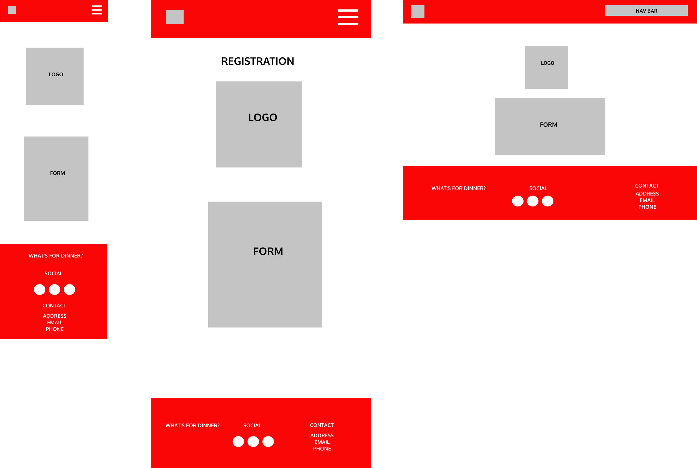

# **CODE INSTITUTE: MILESTONE PROJECT 2** #

# **WHAT'S FOR DINNER?** #

This website was designed to offer the user a "one-stop" site to be able to search for restaurants in their desired town. The site allows them to filter the restaurants by cost/style and to then be provided the contact details of the chosen restaurant or to be able to hop on to their booking engine. The site also provides an unfiltered list and locations are provided using the Google Maps API so that they can see where the restaurants are located. There is also the option to sign up for updates and for businesses to request to join the site.

This is the second of four Milestone Projects required for the Full Stack Web Development course provided by Code Institute. The main goal for this project was to produce an "interactive front-end site to present useful information to the users" using HTML, CSS and JavaScript.

## **CONTENTS** ##

- [UX](#ux)
  - [Project Goals](#project-goals)
  - [User Stories](#user-stories)
  - [Design Process](#design-process)
    - [Fonts](#fonts)
    - [Colours](#colours)
    - [Wireframes](#wireframes)
- [Technology Used](#technology-used)
  - [Languages and Frameworks](#languages-and-frameworks)
  - [API's](#API'S)
  - [Tools](#tools)
- [Features](#features)
- [Testing](#testing)
- [Deployment](#deployment)
  - [Hosting](#hosting)
  - [Cloning](#cloning)
- [Credits](#credits)
  - [Images](#images)
  - [Image editing](#image-editing)
- [Acknowledgements](#acknowledgements)

## **UX** ##

### <ins>PROJECT GOALS</ins> ### 

The main aim of this project was to create a website that would give the user a useful website that would allow them to see local restaurants and to be able to filter the available restaurants by cost/style. Information would be provided to the user and also the ability to link to the individual restaurant sites to allow them to book through their booking engine or to contact them directly.
 
- To promote restaurants in the area to the **user** to help increase footfall and therefore revenue.
- To provide an intuitive web app that the **user** can navigate easily.
- To gain contact details from the **user** to allow future updates/additions to the site to be communicated by the **site owner**.

[Back to Contents](#contents)

### <ins>USER STORIES</ins> ###

- As a **user**, I want to see what restaurants are available in the town that I am in.
- As a **user**, I want to be able to choose a restaurant based on it's price level.
- As a **user**, I want to be able to choose a restaurant based on the type of food it offers.
- As a **user**, I want to be able to see where the restaurants are located within the town I am interested in.
- As a **user**, I want to be able to contact the restaurant of choice either through their website booking engine or by being provided contact details.
- As a **user**, I want to be able to obtain basic information about the restaurants in the town that I am to help me decide where to reserve a table.
- As a **user**, I want the site navigation to be intuitive and easy to use.
- As a **user**, I want the information to be displayed in a clear and organised manner to allow for quick decisions to be made.
- As a **user**, I want to be able to register with the **site owners** so that I can be informed of new restaurants registering on the site.
- As a **business owner**, I want the information on the site to represent my business and to look attractive.
- As a **business owner**, I want to be able to register my interest with the **site owners** so that they can add me to the site.

[Back to Contents](#contents)

### <ins>DESIGN PROCESS</ins> ###

1. The concept of this site comes from my Hospitality background and my feeling that, due to the current pandemic, restaurants need to be championed to help them in the coming months. As this site is intended to raise user awareness of what restaurants are available in their area, I decided to keep it fairly simple and to ensure that the end result was a restaurant being booked by the user.

2. The colour scheme chosen was based on a strong red colour (#fa0606) and white as I felt that it was distinctive (think Vodafone or Virgin Media) and by keeping it simple it doesn't detract from the main point of the site - getting the user to book a restaurant.

3. I used [Figma](https://figma.com/) to create my wireframes and used it to organise the flow of the site and how the different pages would respond to different screen sizes. 

4. As with my first project, the design changed slightly as I was building the site. I am finding that what I initially think is a "good idea" at the start of the design process ends up not being the case and is modified during the build process. I realise that this is not the best way to build a site but am working towards ensuring the design is completed first and acts as a map for the building process.

5. I referred to my User Stories and Wireframes throughout the process and all changes made , as mentioned above, were to improve the initial design choices that were considered inappropriate.

[Back to Contents](#contents)

### <ins>FONTS</ins> ###

I chose the Oxygen font family for my headers and the Roboto font family for any body text. Both fonts were chosen from [Google Fonts](https://fonts.google.com/) and the styles were imported in to the style.css file.

### <ins>COLOURS</ins> ###

A red (#fa0606) colour for the Navigation Bar and a complimentary red colour (#fb3838) for Footer, main Buttons and the Accordion to maintain a consistent feel throughout. The colours used were picked from the base colour (#fa0606) using [0to255](https://www.0to255.com/) to ensure there is visible flow throughout the site. The decision to use this simple colour scheme was taken from my observation that businesses such as Virgin Media and Vodafone are easily recognisable due to similar colour choices in their brand identities.

### <ins>WIREFRAMES</ins> ###

The full wireframe for the site can be found [here](assets/images/readme/wireframes/figfull.png).

### Landing Page ###

### Locations Page ###

### Town Pages ###

### Filter Pages ###

### Register Page ###

[Back to Contents](#contents)

---  

## **TECHNOLOGY USED** ##

### <ins>LANGUAGES AND FRAMEWORKS</ins> ###

- [HTML](https://developer.mozilla.org/en-US/docs/Web/HTML) - used to create the site structure.
- [CSS](https://developer.mozilla.org/en-US/docs/Web/CSS) - used to create the styling throughout the site.
- [JavaScript](https://developer.mozilla.org/en-US/docs/Web/JavaScript) - this was used for the modal information, the Google Maps markers, the "back to top" button and the registration forms - user and business user.  
- [jQuery](https://jquery.com/) - this was used for the image filtering function.
- [Font-Awesome](https://fontawesome.com/icons?d=gallery) - icons were taken from this site for the footer and social buttons.
- [Bootstrap](https://getbootstrap.com/) - I relied on Bootstrap for the responsive grid design and NavBar.
- [Google fonts](https://fonts.google.com/) - as previously stated, the fonts used were taken from here.
- [Popper](https://popper.js.org/)
- [Popper JS](https://popper.js.org/)

### <ins>API'S</ins> ###

- [EmailJS](https://emailjs.com) - this was used to host the email functionality of the site.
- [Google Maps API](https://developers.google.com/maps/) - this was used to allow Google Maps and Markers to be installed on the site.
  
### <ins>TOOLS</ins> ###

- [Git](https://git-scm.com/) - version control and recording of all changes to site during development process.
- [GitHub](https://github.com/) - used for hosting website.
- [GitPod](https://gitpod.io) - IDE used for code editing. 
- [Figma](https://figma.com/) - wireframing
- [Google Fonts](https://fonts.google.com/) - used to select font families.
- [W3C Validator](https://validator.w3.org/) - used to test my HTML to ensure there were no errors.
- [W3C Validator CSS](https://jigsaw.w3.org/css-validator/) - used to test my CSS to ensure there were no errors.
- [JSHint](https://https://jshint.com/) - used to test my JS to ensure there were no errors.
- [WAVE](https://wave.webaim.org/) - used to test accesibility of site.
- [Free Formatter](https://freeformatter.com/html-formatter.html#ad-output) - html formatter to help keep things tidy!
- [Am I Responsive](http://ami.responsivedesign.is/#) - used to create responsive image for readme.MD.
- [Favicon](https://favicon.io/) - used to generate the Favicon on the webpage tab.
- [Snazzy Maps](https://snazzymaps.com) - used to change the Google Map style.

[Back to Contents](#contents)

---

## **FEATURES** ##

### <ins>FEATURES IMPLEMENTED</ins> ###

### ELEMENTS SEEN ON ALL PAGES ###

- Grid system used to structure pages and make them responsive for various viewports.
- Bootstrap NavBar with dropdowns to allow easy navigation of the web app. Able to reach all pages from the NavBar without having to return to the Landing Page. 
- Footer contants Social Media links to the site owners pages.
- Favicon in the title tab of the browser.
- "Back to Top " button to allow quick top of the screen navigation on the longer pages.
- Hover used on all buttons and web/email address links.

### ELEMENTS SEEN ON THE LANDING PAGE ###

- Jumbotron with site logo and site title in the middle of the page. Distinctive and simple.
- "Hero" button to enter the site.

### ELEMENTS SEEN ON THE LOCATIONS PAGE ###

- Images of towns available to choose from that are all linked to the relevant pages with **<a>** tags.
- Buttons to navigate the **user** to the appropriate Town or Filter page.
- Faded out Maidenhead logo with countdown timer to indicate that this will be added to the site in the near future.
- Buttons for Maidenhead take the **user** to a 404 page.

### ELEMENTS SEEN ON THE 3 TOWN PAGES ###

- Google Map at top of the page with Markers for each restaurant location.
- Markers have titles on first click and titles with description on second click on desktop.
- Markers have titles with description on click on all touch screen devices.
- Bootstrap Accordion with relevant information contained in each panel.
- Phone and Website information is wrapped in an anchor tag.
- Website information takes the **user** to the restaurants own website and has a **target="_blank"** to allow navigation back to the site.
- Book button which takes the **user** to the restaurants own website booking engine to allow them to reserve a table.

### ELEMENTS SEEN ON THE 3 FILTER PAGES ###

- 2 rows of filters - Cost and Style - that allow the **user** to narrow down their potential selection of a restaurant.
- Grid of images depicting the restaurants on offer.
- On selecting a filter, the images not linked to the **data-tag** are hidden.
- Clicking a restaurant image presents a **modal** that contains the relevant information.
- The **modal** drops down from the top of the screen and places an overlay over the main page to draw attention to the information it contains.
- The **user** can navigate to the restaurants own website by clicking on the web address and, again, this has a **target="_blank"** to allow navigation back to the site.
- Book button which takes the **user** to the restaurants own website booking engine to allow them to reserve a table.

### ELEMENTS SEEN ON THE 2 REGISTRATION PAGES ###

- Jumbotron with site logo and site title in the middle of the page.
- Simple form requesting basic informtation from the **user**.
- Register button, when clicked, sends the informtation to the EmailJS API.
- The **user** will receive an email from EmailJS confirming their registration.
 
### <ins>FUTURE FEATURES</ins> ###

- **Users** to be able to leave reviews of the restaurants to other **users**.
- Highlight new restaurants as they are added with a banner on their information image.
- **Business Owners** able to completely register their restaurant without waiting for the **site owner** to contact them.
- Multiple images available for each restaurant possibly in a Carousel or Image Gallery format.
- Add a Read More/Read Less function to the Restaurant Information panels on the Accordion's.
- Add a confirmation modal to the Registration function.

[Back to Contents](#contents)

---

## **TESTING** ##

Testing information can be found [here](readme/testing.md).

[Back to Contents](#contents)

---

## **DEPLOYMENT** ##

### <ins>HOSTING</ins>

The site is hosted on [GitHub Pages](https://iainm342.github.io/milestone-2/).

Deployment of the site was achieved by following the steps below:

- opening GitHub in my Google Chrome (or any browser)
- signing in to GitHub using my username and password
- selected my repositories
- navigating to the repo to be deployed (iainm342/milestone-2)
- clicking on settings in the top navigation bar
- scrolling down the page until you reach GitHub pages
- selecting Branch:Master
- selecting Root 
- clicking on Save
- URL generated for use
- site is now live on [GitHub Pages](https://iainm342.github.io/milestone-2/)

### <ins>CLONING</ins>

If you wish to use my project, feel free, you can clone a copy to your machine by doing the following:

- open GitHub
- navigate to the repo (iainm342/milestone-2)
- click the green Code dropdown button
- select the option to open with GitHub
- follow the onscreen instructions and open with GitHub or another IDE

[Back to Contents](#contents)

---

## **CREDITS** ##

### <ins>IMAGES AND TEXT CONTENT</ins> ###

The images and card, text content used were sourced from various sites:

- [Shutterstock](https://shutterstock.com) - dinner plate lofo.
- [Square Meal](https://squaremeal.co.uk) - images and basic restaurant info were taken from this site. 

### <ins>IMAGE EDITING</ins> ###

- I used the Shutterstock editing tool for the vector image used for the logo.

### <ins>CODING IDEAS</ins>

Knowledge, and inspiration, was taken from the Code Institute project - Resume - for certain aspects of the site.

JavaScript & jQuery - Interactive Front-End Web Development by Jon Duckett - for the image filter idea which was then adapted further.

[Back to Contents](#contents)

---

## **ACKNOWLEDGEMENTS** ##

Thank you to the following people:

- My mentor Seun Owonikoko for her time, guidance and making things obvious...
- The guys in the class of May 20 on Slack - always there for a chat when needed!
    - special mentions to @nikkikobako, @Sara and @Pauld0051
- My partner, Paul, for putting up with the growing obsession I have towards coding.

[Back to Contents](#contents)

---